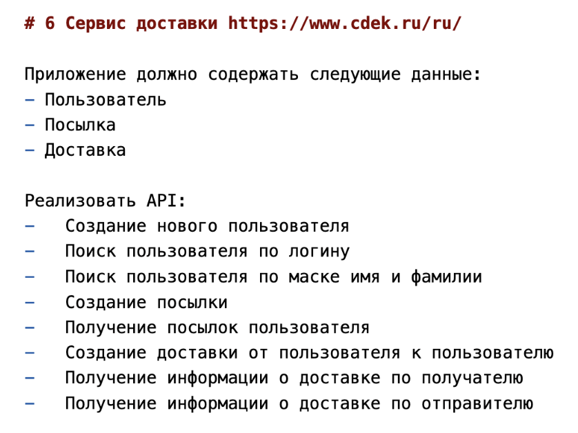
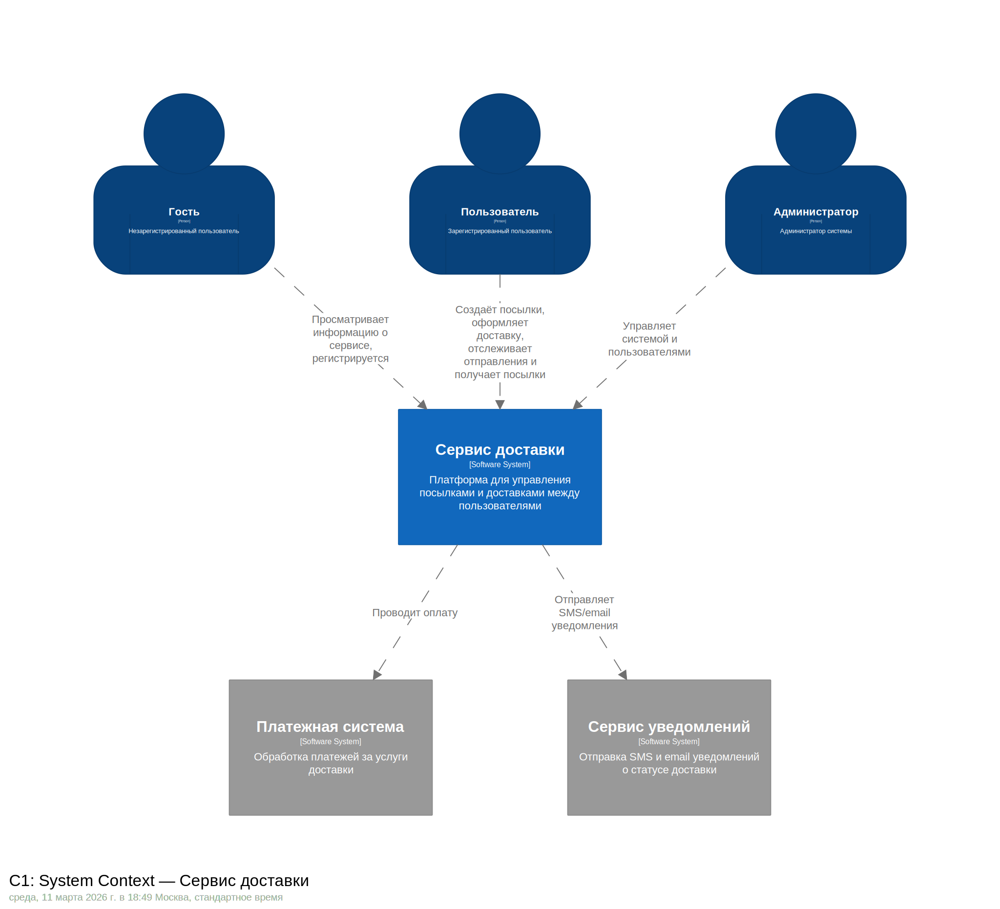
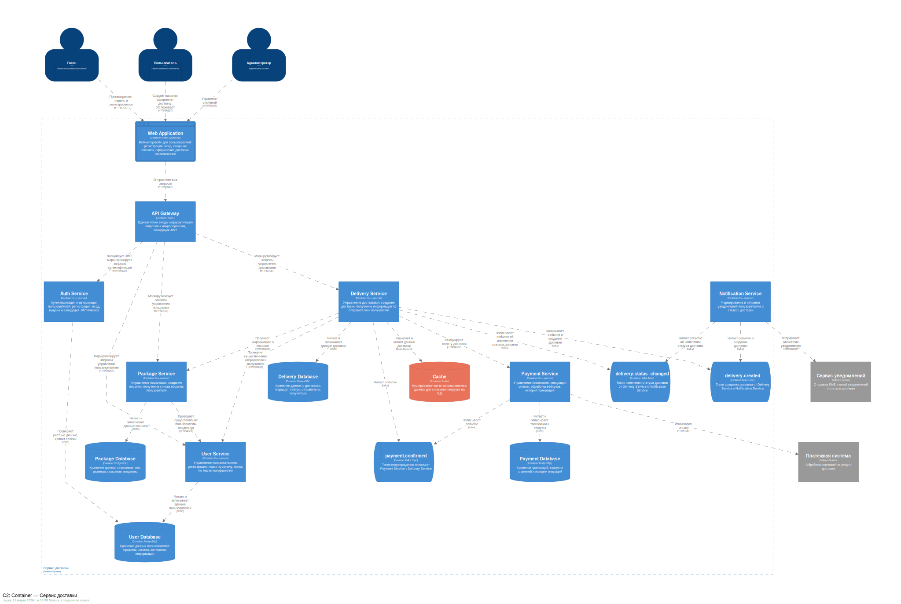
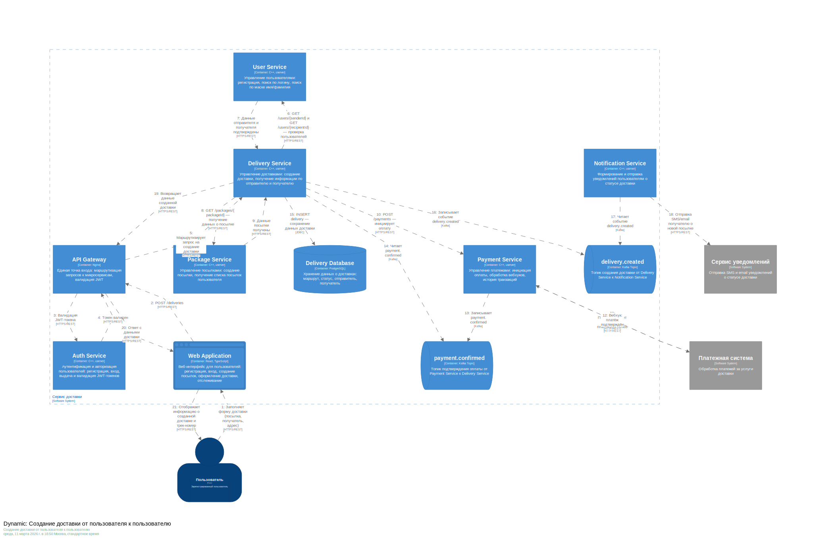

# Домашнее задание 01: Документирование архитектуры в Structurizr

## Вариант: #6 — Сервис доставки

## Задание:

---

## Решение

### 1. Роли пользователей

- **Гость** — незарегистрированный пользователь, может просматривать информацию о сервисе и зарегистрироваться
- **Пользователь** — зарегистрированный участник: создаёт посылки, оформляет доставку, отслеживает отправления и получает посылки
- **Администратор** — управляет пользователями и данными системы

### 2. Внешние системы

- **Платежная система** (Stripe / ЮKassa) — обработка платежей за услуги доставки
- **Сервис уведомлений** — отправка SMS и email уведомлений о статусе доставки

### 3. C1 — System Context

---

### 4. Use Cases

- **UC-1: Просмотр информации о сервисе**\
  Актор: Гость\
  Что: Просмотр главной страницы с описанием сервиса\
  Приоритет: Обязательный

- **UC-2: Регистрация**\
  Актор: Гость → Пользователь\
  Что: Создание аккаунта с указанием логина, имени, фамилии и контактных данных\
  Приоритет: Обязательный

- **UC-3: Авторизация**\
  Актор: Гость → Пользователь / Администратор\
  Что: Вход в систему по логину и паролю, получение JWT-токена\
  Приоритет: Обязательный

- **UC-4: Поиск пользователя по логину**\
  Актор: Пользователь / Администратор\
  Что: Поиск зарегистрированного пользователя по логину\
  Приоритет: Обязательный

- **UC-5: Поиск пользователя по маске имени/фамилии**\
  Актор: Пользователь / Администратор\
  Что: Поиск пользователей по совпадению имени или фамилии\
  Приоритет: Обязательный

- **UC-6: Создание посылки**\
  Актор: Пользователь\
  Что: Создание записи о посылке с указанием веса, размеров и описания\
  Приоритет: Обязательный

- **UC-7: Получение списка посылок**\
  Актор: Пользователь\
  Что: Просмотр всех посылок, принадлежащих текущему пользователю\
  Приоритет: Обязательный

- **UC-8: Создание доставки**\
  Актор: Пользователь\
  Что: Оформление доставки посылки с указанием отправителя, получателя и оплатой\
  Приоритет: Обязательный

- **UC-9: Получение доставок по отправителю**\
  Актор: Пользователь / Администратор\
  Что: Просмотр всех исходящих доставок для конкретного отправителя\
  Приоритет: Обязательный

- **UC-10: Получение доставок по получателю**\
  Актор: Пользователь / Администратор\
  Что: Просмотр всех входящих доставок для конкретного получателя\
  Приоритет: Обязательный

- **UC-11: Оплата доставки**\
  Актор: Пользователь → Платежная система\
  Что: Оплата стоимости доставки через внешний платёжный шлюз (Stripe / ЮKassa)\
  Приоритет: Обязательный

- **UC-12: Уведомления о статусе доставки**\
  Актор: Сервис доставки → Сервис уведомлений → Пользователь\
  Что: Автоматическая отправка SMS/email при создании и изменении статуса доставки\
  Приоритет: Обязательный

- **UC-13: Управление пользователями**\
  Актор: Администратор\
  Что: Просмотр, поиск и управление учётными записями пользователей\
  Приоритет: Обязательный

---

### 5. C2 — Container

---

### 6. Контейнеры

- **Web Application** (React, TypeScript) — веб-интерфейс: регистрация, вход, посылки, доставки, отслеживание
- **API Gateway** (Nginx) — единая точка входа, маршрутизация, валидация JWT, rate limiting
- **Auth Service** (C++, userver) — регистрация, вход, выдача и валидация JWT-токенов
- **User Service** (C++, userver) — управление пользователями, поиск по логину и маске имени/фамилии
- **Package Service** (C++, userver) — создание посылок, получение списка посылок пользователя
- **Delivery Service** (C++, userver) — создание доставок, управление статусами
- **Payment Service** (C++, userver) — инициация оплаты, обработка вебхуков, история транзакций
- **Notification Service** (C++, userver) — формирование и отправка SMS/email уведомлений
- **payment.confirmed** (Kafka Topic) — подтверждение оплаты: Payment Service → Delivery Service
- **delivery.created** (Kafka Topic) — создание доставки: Delivery Service → Notification Service
- **delivery.status_changed** (Kafka Topic) — изменение статуса: Delivery Service → Notification Service
- **User Database** (PostgreSQL) — профили пользователей, логины, контактная информация
- **Package Database** (PostgreSQL) — данные посылок: вес, размеры, описание, владелец
- **Delivery Database** (PostgreSQL) — данные доставок: маршрут, статус, отправитель, получатель
- **Payment Database** (PostgreSQL) — транзакции, статусы платежей, история операций
- **Cache** (Redis) — кэширование данных доставок для снижения нагрузки на БД

---

### 7. Dynamic — Создание доставки

