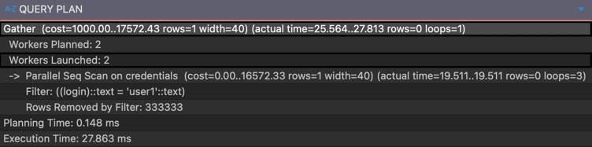
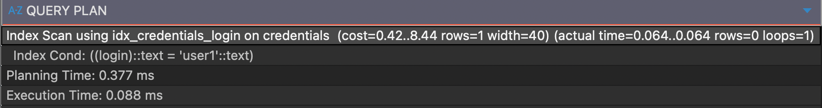
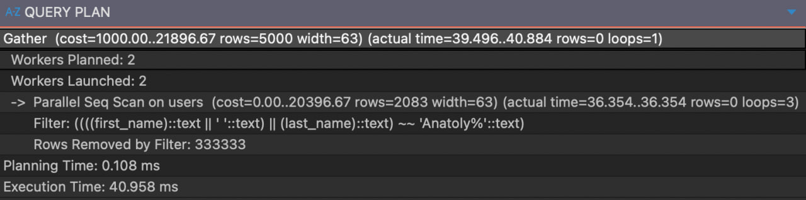
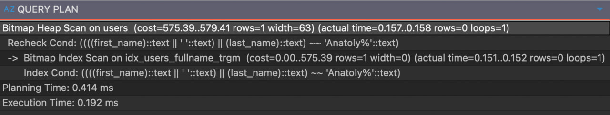
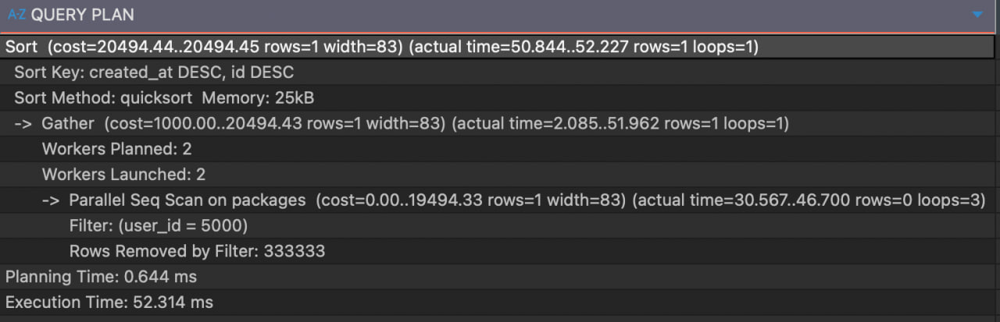
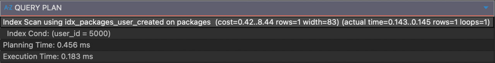

# Оптизимизация запросов PostgreSQL

## Обзор

В проекте используются четыре таблицы: `users`, `packages`, `deliveries`, `credentials`.
Для каждой таблицы были добавлены индексы, устраняющие полный перебор строк (Seq Scan)
и ускоряющие наиболее частые запросы.

**Время выполнения запросов замерялось на таблицах с 1 млн записей**.

---

## Базовые индексы

У всех таблиц были созданы индексы для первичных ключей и индексы для внешних ключей,
подробно заострять внимание на них не будем.

---

## Таблица `credentials`

**Запрос**

```sql
SELECT password_hash FROM credentials WHERE login = $1;
```

**Добавленный индекс**

```sql
CREATE UNIQUE INDEX IF NOT EXISTS idx_credentials_login ON credentials(login);
```

**EXPLAIN до**



**EXPLAIN после**



**Что дал**

- Поиск по `login` теперь использует Index Scan вместо Seq Scan.
- Гарантирована уникальность логина на уровне БД.
- Критично для производительности: запрос проверки пароля выполняется при каждом входе пользователя.
- Время поиска сократилось с 28ms до 0.09ms.

---

## Таблица `users`

**Запрос**

```sql
SELECT id, login, email, first_name, last_name, created_at
FROM users
WHERE first_name || ' ' || last_name LIKE $1;
```

**Добавленные индексы**

```sql
CREATE EXTENSION IF NOT EXISTS pg_trgm;

CREATE INDEX IF NOT EXISTS idx_users_fullname_trgm
ON users USING GIN ((first_name || ' ' || last_name) gin_trgm_ops);
```

**EXPLAIN до**



**EXPLAIN после**



**Что дал**

- Поддерживает любые LIKE-паттерны: `'Dmi%'`, `'%mitri%'`, `'%rii%'`.
- После создания индекса план изменился с Seq Scan на Bitmap Index Scan
- Время выполнения запроса сократилось с 40ms до 0.19ms.

---

## Таблица `packages`

**Запрос**

```sql
SELECT id, user_id, weight, length, width, height, description, created_at
FROM packages
WHERE user_id = $1
ORDER BY created_at DESC, id DESC;
```

### Добавленный индекс

```sql
CREATE INDEX IF NOT EXISTS idx_packages_user_created
    ON packages(user_id, created_at DESC, id DESC);
```

**EXPLAIN до**



**EXPLAIN после**



**Что дал:**

- `user_id` первым — мгновенная фильтрация по пользователю без перебора всей таблицы.
- `created_at DESC, id DESC` совпадают с `ORDER BY` в запросе — сортировка выполняется
  **бесплатно** из индекса, отдельный шаг Sort исчезает из плана.
- Index Scan вместо Parallel Seq Scan + Sort.

---

## Таблица `deliveries`

Добавлены только индексы для внешних ключей

### Добавленные индексы

```sql
CREATE UNIQUE INDEX IF NOT EXISTS idx_deliveries_package_id ON deliveries(package_id);
CREATE INDEX IF NOT EXISTS idx_deliveries_sender_id         ON deliveries(sender_id);
CREATE INDEX IF NOT EXISTS idx_deliveries_recipient_id      ON deliveries(recipient_id);
```

**Что дали:**

- Быстрый поиск всех доставок конкретного отправителя
- Быстрый поиск всех доставок конкретного получателя
- Быстрый поиск достаавки по package_id
- Гарантирована уникальность посылки в доставке на уровне БД.

---
